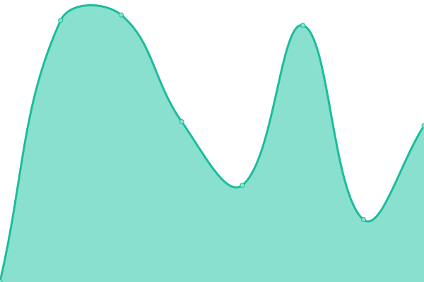
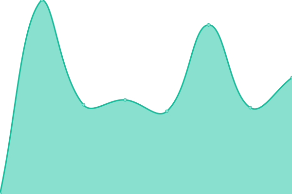

# [📈 Live Status](https://upptime.github.io/upptime): <!--live status--> **🟥 Complete outage**

This repository contains the open-source uptime monitor and status page for [Upptime](https://upptime.js.org), powered by [Upptime](https://github.com/upptime/upptime).

With [Upptime](https://upptime.js.org), you can get your own unlimited and free uptime monitor and status page, powered entirely by a GitHub repository. We use [Issues](https://github.com/upptime/upptime/issues) as incident reports, [Actions](https://github.com/HackConcordia/hc-uptime/actions) as uptime monitors, and [Pages](https://upptime.github.io/upptime) for the status page.

<!--start: status pages-->
<!-- This summary is generated by Upptime (https://github.com/upptime/upptime) -->
<!-- Do not edit this manually, your changes will be overwritten -->
<!-- prettier-ignore -->
| URL | Status | History | Response Time | Uptime |
| --- | ------ | ------- | ------------- | ------ |
|  [HackConcordia](https://hackconcordia.io) | 🟥 Down | [hack-concordia.yml](https://github.com/HackConcordia/HC-Upptime/commits/HEAD/history/hack-concordia.yml) | 

 470ms
     
 | 

<a href="https://HackConcordia.github.io/hc-uptime/history/hack-concordia">99.75%</a>
    

|  [ConUHacks](https://conuhacks.io) | 🟥 Down | [con-u-hacks.yml](https://github.com/HackConcordia/HC-Upptime/commits/HEAD/history/con-u-hacks.yml) | 

 513ms
     
 | 

<a href="https://HackConcordia.github.io/hc-uptime/history/con-u-hacks">99.76%</a>
    

|  [ConUHacks Registration](https://register.conuhacks.io) | 🟥 Down | [con-u-hacks-registration.yml](https://github.com/HackConcordia/HC-Upptime/commits/HEAD/history/con-u-hacks-registration.yml) | 

 222ms
     
 | 

<a href="https://HackConcordia.github.io/hc-uptime/history/con-u-hacks-registration">0.00%</a>
    

<!--end: status pages-->

[**Visit our status website →**](https://upptime.github.io/upptime)

## 📄 License

- Powered by: [Upptime](https://github.com/upptime/upptime)
- Code: [MIT](./LICENSE) © [Upptime](https://upptime.js.org)
- Data in the `./history` directory: [Open Database License](https://opendatacommons.org/licenses/odbl/1-0/)
